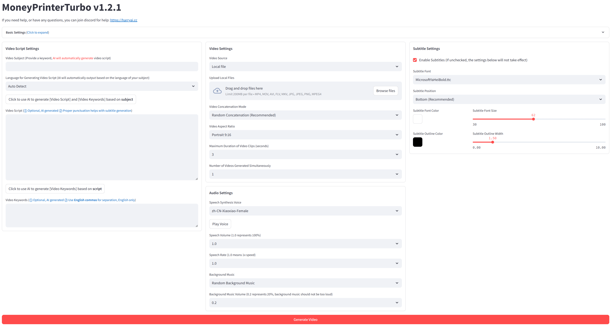
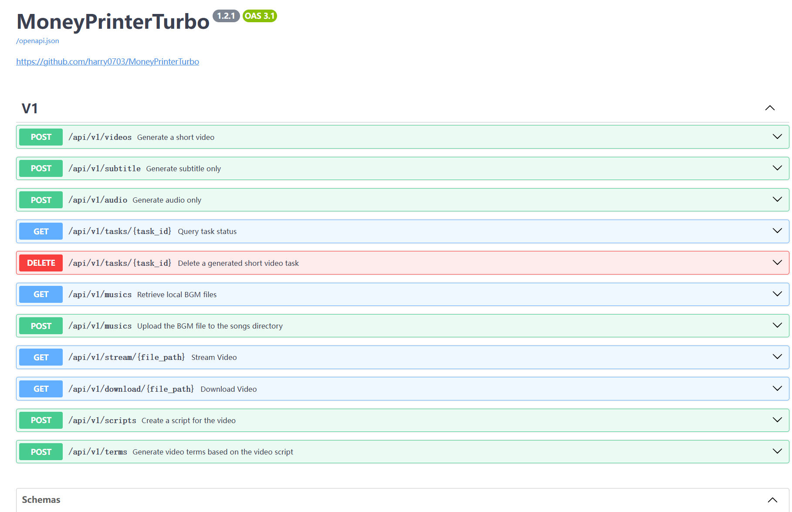

<div align="center">
<h1 align="center">MoneyPrinterTurbo 💸</h1>

<p align="center">
  <a href="https://github.com/harry0703/MoneyPrinterTurbo/stargazers"></a>
  <a href="https://github.com/harry0703/MoneyPrinterTurbo/issues"></a>
  <a href="https://github.com/harry0703/MoneyPrinterTurbo/network/members"></a>
  <a href="https://github.com/harry0703/MoneyPrinterTurbo/blob/main/LICENSE"></a>
</p>

<h3>English | <a href="README.md">简体中文</a></h3>

<div align="center">
  <a href="https://trendshift.io/repositories/8731" target="_blank"></a>
</div>

Simply provide a <b>topic</b> or <b>keyword</b> for a video, and it will automatically generate the video copy, video
materials, video subtitles, and video background music before synthesizing a high-definition short video.

### WebUI



### API Interface



</div>

## Special Thanks 🙏

Due to the **deployment** and **usage** of this project, there is a certain threshold for some beginner users. We would
like to express our special thanks to

**RecCloud (AI-Powered Multimedia Service Platform)** for providing a free `AI Video Generator` service based on this
project. It allows for online use without deployment, which is very convenient.

https://reccloud.com


## Features 🎯

- [x] Complete **MVC architecture**, **clearly structured** code, easy to maintain, supports both `API`
  and `Web interface`
- [x] Supports **AI-generated** video copy, as well as **customized copy**
- [x] Supports various **high-definition video** sizes
    - [x] Portrait 9:16, `1080x1920`
    - [x] Landscape 16:9, `1920x1080`
- [x] Supports **batch video generation**, allowing the creation of multiple videos at once, then selecting the most
  satisfactory one
- [x] Supports setting the **duration of video clips**, facilitating adjustments to material switching frequency
- [x] Supports video copy in both **Chinese** and **English**
- [x] Supports **multiple voice** synthesis
- [x] Supports **subtitle generation**, with adjustable `font`, `position`, `color`, `size`, and also
  supports `subtitle outlining`
- [x] Supports **background music**, either random or specified music files, with adjustable `background music volume`
- [x] Video material sources are **high-definition** and **royalty-free**
- [x] Supports integration with various models such as **OpenAI**, **moonshot**, **Azure**, **gpt4free**, **one-api**,
  **qianwen**, **Google Gemini**, **Ollama** and more

❓[How to Use the Free OpenAI GPT-3.5 Model?](https://github.com/harry0703/MoneyPrinterTurbo/blob/main/README-en.md#common-questions-)

### Future Plans 📅

- [ ] Introduce support for GPT-SoVITS dubbing
- [ ] Enhance voice synthesis with large models for a more natural and emotionally resonant voice output
- [ ] Incorporate video transition effects to ensure a smoother viewing experience
- [ ] Improve the relevance of video content
- [ ] Add options for video length: short, medium, long
- [ ] Package the application into a one-click launch bundle for Windows and macOS for ease of use
- [ ] Enable the use of custom materials
- [ ] Offer voiceover and background music options with real-time preview
- [ ] Support a wider range of voice synthesis providers, such as OpenAI TTS, Azure TTS
- [ ] Automate the upload process to the YouTube platform

## Video Demos 📺

### Portrait 9:16

<table>
<thead>
<tr>
<th align="center"><g-emoji class="g-emoji" alias="arrow_forward">▶️</g-emoji> How to Add Fun to Your Life </th>
<th align="center"><g-emoji class="g-emoji" alias="arrow_forward">▶️</g-emoji> What is the Meaning of Life</th>
</tr>
</thead>
<tbody>
<tr>
<td align="center"><video src="https://github.com/harry0703/MoneyPrinterTurbo/assets/4928832/a84d33d5-27a2-4aba-8fd0-9fb2bd91c6a6" controls autoplay="false"></video></td>
<td align="center"><video src="https://github.com/harry0703/MoneyPrinterTurbo/assets/4928832/112c9564-d52b-4472-99ad-970b75f66476" controls autoplay="false"></video></td>
</tr>
</tbody>
</table>

### Landscape 16:9

<table>
<thead>
<tr>
<th align="center"><g-emoji class="g-emoji" alias="arrow_forward">▶️</g-emoji> What is the Meaning of Life</th>
<th align="center"><g-emoji class="g-emoji" alias="arrow_forward">▶️</g-emoji> Why Exercise</th>
</tr>
</thead>
<tbody>
<tr>
<td align="center"><video src="https://github.com/harry0703/MoneyPrinterTurbo/assets/4928832/346ebb15-c55f-47a9-a653-114f08bb8073" controls autoplay="false"></video></td>
<td align="center"><video src="https://github.com/harry0703/MoneyPrinterTurbo/assets/4928832/271f2fae-8283-44a0-8aa0-0ed8f9a6fa87" controls autoplay="false"></video></td>
</tr>
</tbody>
</table>

## System Requirements 📦

- Recommended minimum 4 CPU cores or more, 8G of memory or more, GPU is not required
- Windows 10 or MacOS 11.0, and their later versions

## Installation & Deployment 📥

- Try to avoid using **Chinese paths** to prevent unpredictable issues
- Ensure your **network** is stable, meaning you can access foreign websites normally

#### ① Clone the Project

```shell
git clone https://github.com/harry0703/MoneyPrinterTurbo.git
```

#### ② Modify the Configuration File

- Copy the `config.example.toml` file and rename it to `config.toml`
- Follow the instructions in the `config.toml` file to configure `pexels_api_keys` and `llm_provider`, and according to
  the llm_provider's service provider, set up the corresponding API Key

#### ③ Configure Large Language Models (LLM)

- To use `GPT-4.0` or `GPT-3.5`, you need an `API Key` from `OpenAI`. If you don't have one, you can set `llm_provider`
  to `g4f` (a free-to-use GPT library https://github.com/xtekky/gpt4free)

### Docker Deployment 🐳

#### ① Launch the Docker Container

If you haven't installed Docker, please install it first https://www.docker.com/products/docker-desktop/
If you are using a Windows system, please refer to Microsoft's documentation:

1. https://learn.microsoft.com/en-us/windows/wsl/install
2. https://learn.microsoft.com/en-us/windows/wsl/tutorials/wsl-containers

```shell
cd MoneyPrinterTurbo
docker-compose up
```

> Note：The latest version of docker will automatically install docker compose in the form of a plug-in, and the start command is adjusted to `docker compose up `

#### ② Access the Web Interface

Open your browser and visit http://0.0.0.0:8501

#### ③ Access the API Interface

Open your browser and visit http://0.0.0.0:8080/docs Or http://0.0.0.0:8080/redoc

### Manual Deployment 📦

#### ① Create a Python Virtual Environment

It is recommended to create a Python virtual environment
using [conda](https://conda.io/projects/conda/en/latest/user-guide/install/index.html)

```shell
git clone https://github.com/harry0703/MoneyPrinterTurbo.git
cd MoneyPrinterTurbo
conda create -n MoneyPrinterTurbo python=3.11
conda activate MoneyPrinterTurbo
pip install -r requirements.txt
```

#### ② Install ImageMagick

###### Windows:

- Download https://imagemagick.org/archive/binaries/ImageMagick-7.1.1-29-Q16-x64-static.exe
- Install the downloaded ImageMagick, **do not change the installation path**
- Modify the `config.toml` configuration file, set `imagemagick_path` to your actual installation path (if you didn't
  change the path during installation, just uncomment it)

###### MacOS:

```shell
brew install imagemagick
````

###### Ubuntu

```shell
sudo apt-get install imagemagick
```

###### CentOS

```shell
sudo yum install ImageMagick
```

#### ③ Launch the Web Interface 🌐

Note that you need to execute the following commands in the `root directory` of the MoneyPrinterTurbo project

###### Windows

```bat
conda activate MoneyPrinterTurbo
webui.bat
```

###### MacOS or Linux

```shell
conda activate MoneyPrinterTurbo
sh webui.sh
```

After launching, the browser will open automatically

#### ④ Launch the API Service 🚀

```shell
python main.py
```

After launching, you can view the `API documentation` at http://127.0.0.1:8080/docs and directly test the interface
online for a quick experience.

## Voice Synthesis 🗣

A list of all supported voices can be viewed here: [Voice List](./docs/voice-list.txt)

## Subtitle Generation 📜

Currently, there are 2 ways to generate subtitles:

- edge: Faster generation speed, better performance, no specific requirements for computer configuration, but the
  quality may be unstable
- whisper: Slower generation speed, poorer performance, specific requirements for computer configuration, but more
  reliable quality

You can switch between them by modifying the `subtitle_provider` in the `config.toml` configuration file

It is recommended to use `edge` mode, and switch to `whisper` mode if the quality of the subtitles generated is not
satisfactory.

> Note:
> If left blank, it means no subtitles will be generated.

**Download whisper**
- Please ensure a good internet connectivity
- `whisper` model can be downloaded from HuggingFace: https://huggingface.co/openai/whisper-large-v3/tree/main

After downloading the model to local machine, copy the whole folder and put it into the following path: `.\MoneyPrinterTurbo\models`

This is what the final path should look like: `.\MoneyPrinterTurbo\models\whisper-large-v3`

```
MoneyPrinterTurbo  
  ├─models
  │   └─whisper-large-v3
  │          config.json
  │          model.bin
  │          preprocessor_config.json
  │          tokenizer.json
  │          vocabulary.json
```

## Background Music 🎵

Background music for videos is located in the project's `resource/songs` directory.
> The current project includes some default music from YouTube videos. If there are copyright issues, please delete
> them.

## Subtitle Fonts 🅰

Fonts for rendering video subtitles are located in the project's `resource/fonts` directory, and you can also add your
own fonts.

## Common Questions 🤔

### ❓How to Use the Free OpenAI GPT-3.5 Model?

[OpenAI has announced that ChatGPT with 3.5 is now free](https://openai.com/blog/start-using-chatgpt-instantly), and
developers have wrapped it into an API for direct usage.

**Ensure you have Docker installed and running**. Execute the following command to start the Docker service:

```shell
docker run -p 3040:3040 missuo/freegpt35
```

Once successfully started, modify the `config.toml` configuration as follows:

- Set `llm_provider` to `openai`
- Fill in `openai_api_key` with any value, for example, '123456'
- Change `openai_base_url` to `http://localhost:3040/v1/`
- Set `openai_model_name` to `gpt-3.5-turbo`

### ❓RuntimeError: No ffmpeg exe could be found

Normally, ffmpeg will be automatically downloaded and detected.
However, if your environment has issues preventing automatic downloads, you may encounter the following error:

```
RuntimeError: No ffmpeg exe could be found.
Install ffmpeg on your system, or set the IMAGEIO_FFMPEG_EXE environment variable.
```

In this case, you can download ffmpeg from https://www.gyan.dev/ffmpeg/builds/, unzip it, and set `ffmpeg_path` to your
actual installation path.

```toml
[app]
# Please set according to your actual path, note that Windows path separators are \\
ffmpeg_path = "C:\\Users\\harry\\Downloads\\ffmpeg.exe"
```

### ❓Error generating audio or downloading videos

[issue 56](https://github.com/harry0703/MoneyPrinterTurbo/issues/56)

```
failed to generate audio, maybe the network is not available. 
if you are in China, please use a VPN.
```

[issue 44](https://github.com/harry0703/MoneyPrinterTurbo/issues/44)

```
failed to download videos, maybe the network is not available. 
if you are in China, please use a VPN.
```

This is likely due to network issues preventing access to foreign services. Please use a VPN to resolve this.

### ❓ImageMagick is not installed on your computer

[issue 33](https://github.com/harry0703/MoneyPrinterTurbo/issues/33)

1. Follow the `example configuration` provided `download address` to
   install https://imagemagick.org/archive/binaries/ImageMagick-7.1.1-30-Q16-x64-static.exe, using the static library
2. Do not install in a path with Chinese characters to avoid unpredictable issues

[issue 54](https://github.com/harry0703/MoneyPrinterTurbo/issues/54#issuecomment-2017842022)

For Linux systems, you can manually install it, refer to https://cn.linux-console.net/?p=16978

Thanks to [@wangwenqiao666](https://github.com/wangwenqiao666) for their research and exploration

## Feedback & Suggestions 📢

- You can submit an [issue](https://github.com/harry0703/MoneyPrinterTurbo/issues) or
  a [pull request](https://github.com/harry0703/MoneyPrinterTurbo/pulls).

## Reference Projects 📚

This project is based on https://github.com/FujiwaraChoki/MoneyPrinter and has been refactored with a lot of
optimizations and added functionalities. Thanks to the original author for their spirit of open source.

## License 📝

Click to view the [`LICENSE`](LICENSE) file

## Star History

[](https://star-history.com/#harry0703/MoneyPrinterTurbo&Date)
